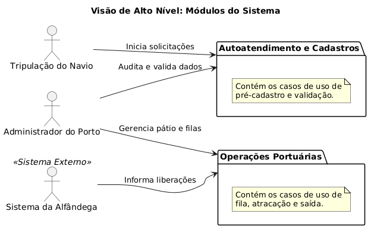
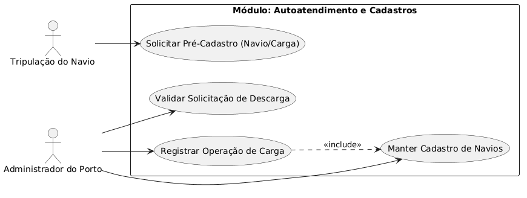
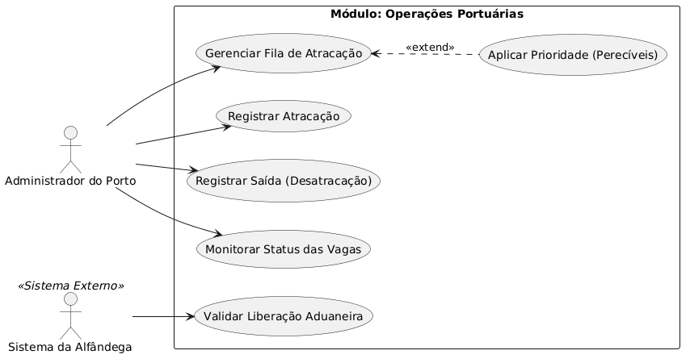
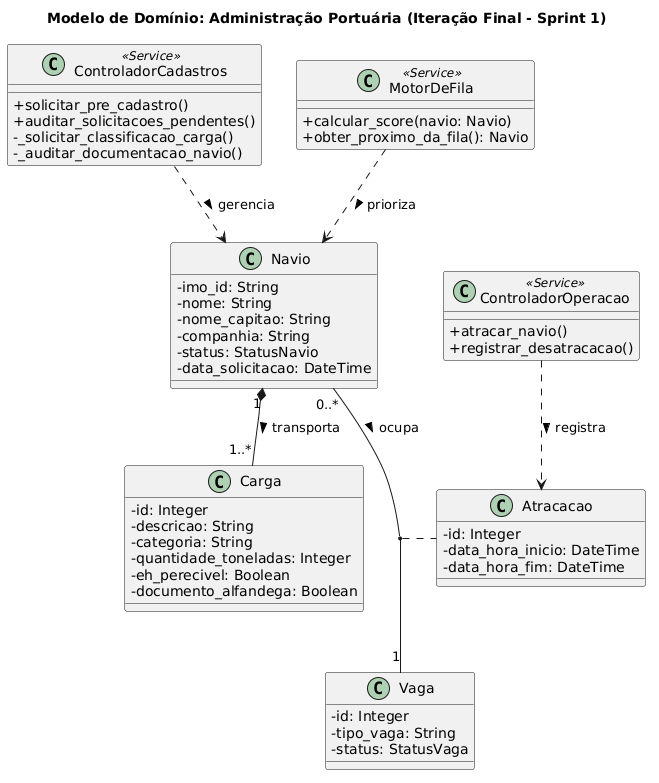
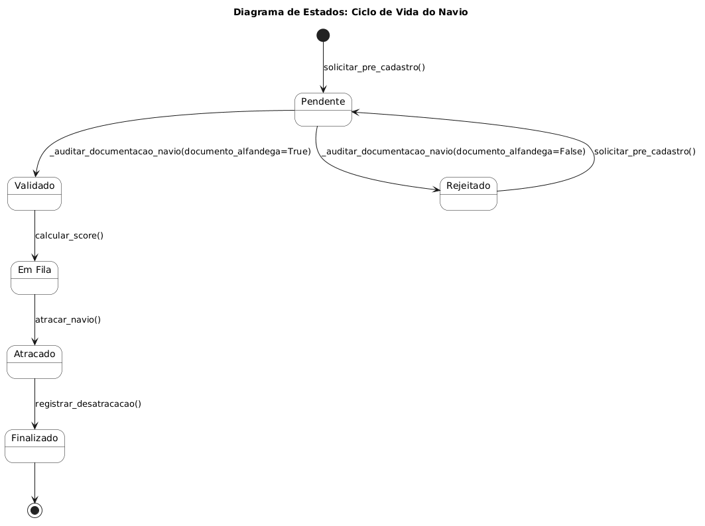
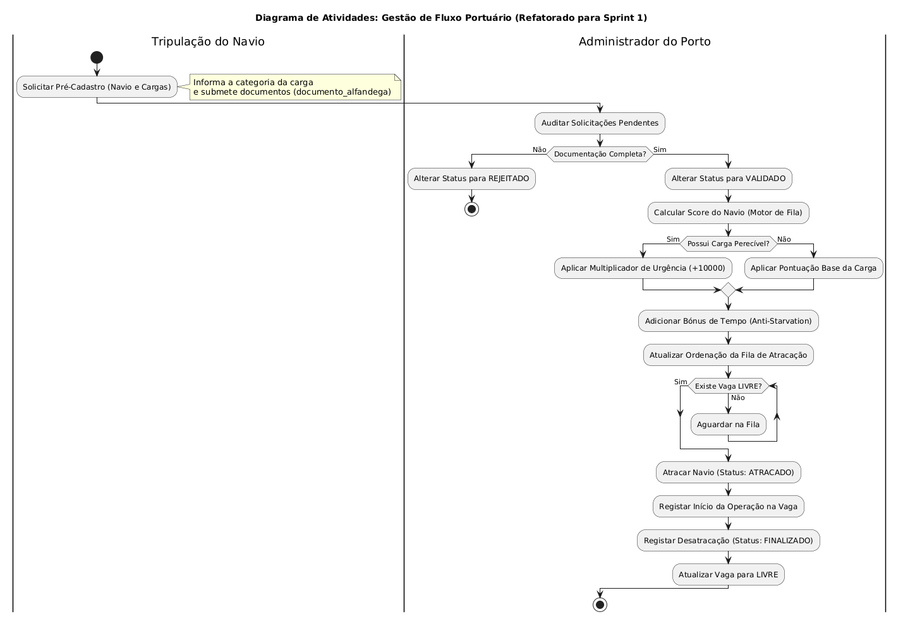

# Diagramas do Sistema

Nesta seção, encontram-se os diagramas estruturais e comportamentais (PlantUML / UML 2.0) que modelam o funcionamento do Porto.

## Diagramas de Caso de Uso 

### Diagramas detalhados de Caso de Uso

## Diagramas de Classe 

## Diagramas de Sequencia

### Diagrama de Sequencia 1

### Diagrama de Sequencia 2

### Diagrama de Sequencia 3

### Diagramas de Sequência — Interface Gráfica (GUI)

#### Sequência GUI 1: Inicialização e Navegação no Painel do Administrador

#### Sequência GUI 2: Portal da Tripulação e Visualização da Fila

## Diagrama de Estados

## Diagrama de Atividades

### Diagrama de Atividades 1 (Navio)

### Diagrama de Atividades 2 (Atracação)
.png)